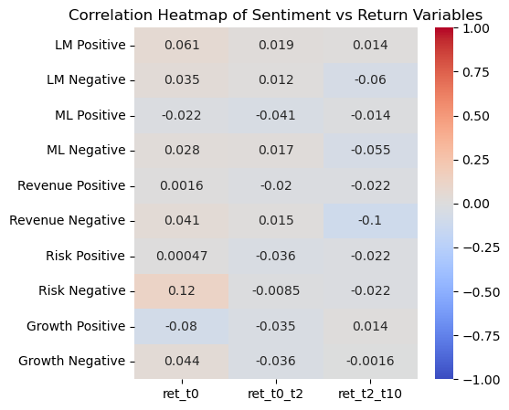
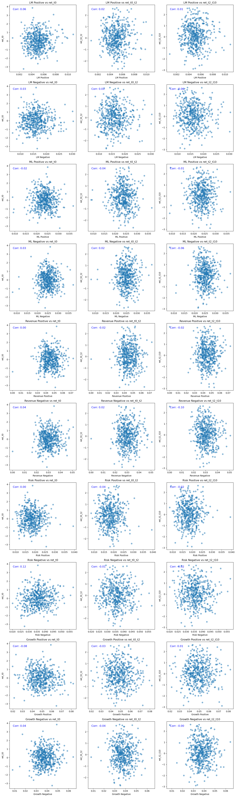

## Summary 
This analysis explores the relationship between sentiment measures derived from 10-K filings and firm returns around the 10-K release. The key question being asked is whether sentiment, both general and contextual, as reflected in the 10-K filings, has a significant impact on stock returns during different windows around the filing date. I constructed a dataset by merging sentiment data from financial filings with return data for firms in the S&P 500 in 2022, which allows us to test how various sentiment measures relate to stock performance. The findings suggest that both general sentiment and contextual sentiment exhibit varying degrees of relationship with stock returns.

I also explored the mechanical construction of sentiment variables, considering both lexicon-based sentiment measures and topic-specific contextual sentiment measures, focusing on revenue, risk, and growth. The correlation analysis showed some meaningful relationships between sentiment and returns, which were further explored through scatter plots and regression models.

## Data Section
**Sample Description**

The sample consists of 498 firms from the S&P 500 index, and the sample period is limited to 2022. Each observation represents a firm, with data collected from its 10-K filing and corresponding stock returns. The dataset includes both financial return variables and sentiment measures extracted from the filings.

**Return Variables**

- ret_t0: This variable measures the firm's stock returns on the day of the 10-K filing.
- ret_t0_t2: This return measure represents the stock return from the 10-K filing date to two days afterward.
- ret_t2_t10: This return measure captures the stock return two days after the 10-K filing to ten days after.
These return measures are calculated as the percentage change in price over the specified windows. The formula for return calculation is:

*<center>Return = (Price at End of Period - Price at Start of Period)/(Price at Start of Period)</center>*

**Sentiment Variables Construction**

The sentiment variables are divided into two categories: general sentiment and contextual sentiment. The general sentiment variables are derived from the LM and ML sentiment dictionaries, while the contextual sentiment variables are based on specific topics like revenue, risk, and growth.

- LM Sentiment: The LM Positive and LM Negative variables measure the fraction of positive and negative words, respectively, in the 10-K filing as compared to the LM sentiment lexicon. These dictionaries contain predefined lists of positive and negative words.
- ML Sentiment: The ML Positive and ML Negative variables represent sentiment based on another sentiment lexicon (ML) containing its own lists of positive and negative words.

The general sentiment measures are derived by calculating the fraction of sentiment-related words in each 10-K filing. The formulas for these variables are as follows:

*<center>Positive Sentiment = (Count of Positive Words)/(Total Words in FIling)</center>*

 *<center>Negative Sentiment = (Count of Negative Words)/(Total Words in FIling)</center>*
 
Contextual Sentiment Variables: These are specific to three topics: Revenue, Risk, and Growth. I extracted relevant sentences from the 10-K filings based on keyword searches (e.g., "revenue", "growth", "risk") and then calculated sentiment for these subsets of text using the ML sentiment dictionary.
- Revenue Positive/Negative
- Risk Positive/Negative
- Growth Positive/Negative


**Number of words in each dictionary:**

LM_positive = 2,345

LM_negative = 347

ML_positive = 75

ML_negative = 94

## Contextual Sentiment Topics

The three topics chosen for contextual sentiment measures were revenue, risk, and growth. These were selected based on their relevance to financial performance and investor concerns. These topics are often discussed in 10-K filings and are directly related to a firm's prospects, making them likely to influence stock returns.

## Summary Statistics


```python
import numpy as np
import pandas as pd
import matplotlib.pyplot as plt
import seaborn as sns
merged_df = pd.read_csv('output/analysis_sample.csv')
merged_df.describe()
```


<div>
<style scoped>
    .dataframe tbody tr th:only-of-type {
        vertical-align: middle;
    }

    .dataframe tbody tr th {
        vertical-align: top;
    }

    .dataframe thead th {
        text-align: right;
    }
</style>
<table border="1" class="dataframe">
  <thead>
    <tr style="text-align: right;">
      <th></th>
      <th>CIK</th>
      <th>ret_t0</th>
      <th>ret_t0_t2</th>
      <th>ret_t2_t10</th>
      <th>LM Positive</th>
      <th>LM Negative</th>
      <th>ML Positive</th>
      <th>ML Negative</th>
      <th>Revenue Positive</th>
      <th>Revenue Negative</th>
      <th>Risk Positive</th>
      <th>Risk Negative</th>
      <th>Growth Positive</th>
      <th>Growth Negative</th>
    </tr>
  </thead>
  <tbody>
    <tr>
      <th>count</th>
      <td>5.010000e+02</td>
      <td>501.000000</td>
      <td>501.000000</td>
      <td>501.000000</td>
      <td>501.000000</td>
      <td>501.000000</td>
      <td>501.000000</td>
      <td>501.000000</td>
      <td>501.000000</td>
      <td>501.000000</td>
      <td>501.000000</td>
      <td>501.000000</td>
      <td>501.000000</td>
      <td>501.000000</td>
    </tr>
    <tr>
      <th>mean</th>
      <td>7.903257e+05</td>
      <td>0.006290</td>
      <td>0.035196</td>
      <td>0.103309</td>
      <td>0.005098</td>
      <td>0.016078</td>
      <td>0.023637</td>
      <td>0.025049</td>
      <td>0.045124</td>
      <td>0.030386</td>
      <td>0.018345</td>
      <td>0.035837</td>
      <td>0.049022</td>
      <td>0.037767</td>
    </tr>
    <tr>
      <th>std</th>
      <td>5.526913e+05</td>
      <td>0.984378</td>
      <td>0.973936</td>
      <td>1.008691</td>
      <td>0.001340</td>
      <td>0.003645</td>
      <td>0.003438</td>
      <td>0.003116</td>
      <td>0.007879</td>
      <td>0.005801</td>
      <td>0.003852</td>
      <td>0.005858</td>
      <td>0.010015</td>
      <td>0.006948</td>
    </tr>
    <tr>
      <th>min</th>
      <td>1.800000e+03</td>
      <td>-3.241267</td>
      <td>-2.696887</td>
      <td>-2.896255</td>
      <td>0.000888</td>
      <td>0.007003</td>
      <td>0.008992</td>
      <td>0.007954</td>
      <td>0.000000</td>
      <td>0.000000</td>
      <td>0.008420</td>
      <td>0.020101</td>
      <td>0.019732</td>
      <td>0.008043</td>
    </tr>
    <tr>
      <th>25%</th>
      <td>9.747600e+04</td>
      <td>-0.702053</td>
      <td>-0.592394</td>
      <td>-0.601368</td>
      <td>0.004274</td>
      <td>0.013600</td>
      <td>0.021654</td>
      <td>0.023188</td>
      <td>0.039551</td>
      <td>0.026703</td>
      <td>0.015723</td>
      <td>0.031973</td>
      <td>0.041808</td>
      <td>0.033175</td>
    </tr>
    <tr>
      <th>50%</th>
      <td>8.832410e+05</td>
      <td>0.012592</td>
      <td>0.029756</td>
      <td>0.104201</td>
      <td>0.005058</td>
      <td>0.015825</td>
      <td>0.023736</td>
      <td>0.024914</td>
      <td>0.044563</td>
      <td>0.029831</td>
      <td>0.018139</td>
      <td>0.035714</td>
      <td>0.048282</td>
      <td>0.037344</td>
    </tr>
    <tr>
      <th>75%</th>
      <td>1.137774e+06</td>
      <td>0.645376</td>
      <td>0.654366</td>
      <td>0.753342</td>
      <td>0.005811</td>
      <td>0.018036</td>
      <td>0.025750</td>
      <td>0.026831</td>
      <td>0.050514</td>
      <td>0.033640</td>
      <td>0.020450</td>
      <td>0.039272</td>
      <td>0.054613</td>
      <td>0.042363</td>
    </tr>
    <tr>
      <th>max</th>
      <td>1.868275e+06</td>
      <td>3.852731</td>
      <td>2.632382</td>
      <td>2.601683</td>
      <td>0.010893</td>
      <td>0.030427</td>
      <td>0.036718</td>
      <td>0.037289</td>
      <td>0.072667</td>
      <td>0.050664</td>
      <td>0.039427</td>
      <td>0.057229</td>
      <td>0.081978</td>
      <td>0.064248</td>
    </tr>
  </tbody>
</table>
</div>


The final dataset consists of 501 observations, each representing a company. The return variables exhibit notable variation, with ret_t0 (return on the publication date) showing a mean of 0.63% and a standard deviation of 0.98. ret_t0_t2 (return from publication to 2 days later) has a mean of 3.52%, while ret_t2_t10 (return from 2 to 10 days later) shows the highest mean at 10.33%. The highest contextual sentiment score was associated with positive growth (8.2%), while the lowest was linked to negative growth (0.8%), excluding the zero values for positive and negative revenue. On average, positive growth received the most attention across all 10-K filings in the sample.

## Correlation of Heatmap of Sentiment vs Return Variables


```python
sentiment_columns = ['LM Positive', 'LM Negative', 'ML Positive', 'ML Negative', 
                     'Revenue Positive', 'Revenue Negative', 
                     'Risk Positive', 'Risk Negative', 
                     'Growth Positive', 'Growth Negative']
return_columns = ['ret_t0', 'ret_t0_t2', 'ret_t2_t10']

correlation_matrix = merged_df[sentiment_columns + return_columns].corr()

correlation_matrix_sentiment_return = correlation_matrix.loc[sentiment_columns, return_columns]

plt.figure(figsize=(5, 5))
sns.heatmap(correlation_matrix_sentiment_return, annot=True, cmap='coolwarm', vmin=-1, vmax=1)
plt.title("Correlation Heatmap of Sentiment vs Return Variables")
plt.show()
```


    

    


## Scatterplot


```python
n_sentiment = len(sentiment_columns)
n_returns = len(return_columns) 

fig, axes = plt.subplots(n_sentiment, n_returns, figsize=(15, 5 * n_sentiment))

axes = axes.flatten()

for i, sentiment in enumerate(sentiment_columns):
    for j, return_var in enumerate(return_columns):
        ax = axes[i * n_returns + j] 
        
        # Scatter plot
        ax.scatter(merged_df[sentiment], merged_df[return_var], alpha=0.5)
        ax.set_title(f"{sentiment} vs {return_var}")
        ax.set_xlabel(sentiment)
        ax.set_ylabel(return_var)

        corr = merged_df[sentiment].corr(merged_df[return_var])
        
        ax.text(0.05, 0.95, f'Corr: {corr:.2f}', transform=ax.transAxes, fontsize=12, color='blue', verticalalignment='top')

plt.tight_layout()
plt.show()
```


    

    


## Discussion Topics
1. The scatterplot and correlation indicate a positive relationship between LM positive sentiment, LM negative sentiment, and ML negative sentiment and returns on the day of the 10-K filing. LM positive sentiment had the highest correlation of 0.06 There was a very weak, negative correlation (-0.02) between ML positive sentiment and stock returns on the day of the filing. Because the correlations of these four relationships were considerably close to zero, ranging from -0.02 to 0.06, the overall sentiment of a 10-K file does not seem to have a significant impact on stock returns the day the 10-K is filed.
2. The differences between my results and those in Table 3 of the Garcia, Hu, and Rohrer paper are likely due to sampling variety. My analysis includes fewer firms observed over a shorter period of time, which could impact the magnitude and significance of the relationship between sentiment and return. Their larger dataset likely produces more accurate and reliable figures because of the scope of their study.
3. The correlations between negative risk sentiment returns and positive growth sentiment and returns were 0.12 and -0.08, respectively. These were the strongest correlations between all of the relationships examined, suggesting they may be worth further examination. The negative correlation between positive growth sentiment and returns is particularly interesting because we would expect to see returns increase as the sentiment around growth prospects increases.
4. ML positive sentiment is negatively correlated with returns across all time windows, suggesting more positive sentiment does not translate to higher returns. The strongest negative effect occurs in the short window from the day of the filing to two days afterward, implying that markets might initially discount excessive optimism or view it as a sign of potential risk. The effect weakens over time, meaning the market may adjust after the initial reaction. ML negative sentiment is slightly positively correlated with immediate returns, which is unexpected. This suggests that investors may not immediately interpret negative sentiment as a red flag. However, the negative correlation over the longer time period of -0.06 suggests that stocks with more negative sentiment in 10-K filings experience declines over time, possibly as concerns about risks materialize. 
